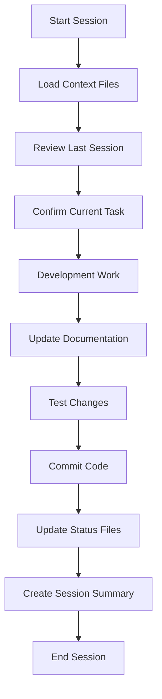

# Professional Development Workflow with Claude

## Context Management Strategy

### 1. Documentation Structure

```
omnix-ai/
├── CLAUDE.md                          # Core project context (already exists)
├── DEVELOPMENT_WORKFLOW.md            # This file - workflow guidelines
├── docs/
│   ├── CURRENT_SPRINT.md             # Active sprint tasks and context
│   ├── DECISIONS_LOG.md              # Architecture decisions record
│   ├── IMPLEMENTATION_NOTES.md       # Technical implementation details
│   └── HANDOFF_NOTES.md             # Session handoff documentation
├── context/
│   ├── customer-ai/
│   │   ├── PHASE_STATUS.md          # Current phase status
│   │   ├── COMPLETED_WORK.md        # What's been done
│   │   ├── NEXT_STEPS.md            # Immediate next tasks
│   │   └── BLOCKERS.md              # Current blockers/questions
│   └── sessions/
│       └── SESSION_YYYY-MM-DD.md     # Daily session summaries
└── task_status.md                     # Master task tracking (already exists)
```

### 2. Session Management Protocol

#### **Start of Each Session**
```markdown
1. Load context files:
   @CLAUDE.md                    # Project context
   @docs/CURRENT_SPRINT.md       # Current sprint
   @context/[module]/PHASE_STATUS.md  # Module status
   @task_status.md              # Task tracking

2. Review last session:
   @context/sessions/SESSION_[LAST_DATE].md

3. Confirm current focus:
   "Continue with [specific task] from [module]"
```

#### **During Session**
```markdown
- Keep sessions focused on ONE module/feature
- Update task_status.md in real-time
- Document decisions in DECISIONS_LOG.md
- Note blockers immediately
```

#### **End of Session**
```markdown
1. Update all status files
2. Create session summary
3. Update NEXT_STEPS.md
4. Commit all changes with descriptive message
```

### 3. Optimal Session Length

#### **Recommended Session Durations**

| Task Type | Optimal Duration | Max Duration | Context Files |
|-----------|-----------------|--------------|---------------|
| **Planning/Design** | 30-45 min | 1 hour | 3-4 files |
| **Implementation** | 45-60 min | 1.5 hours | 5-6 files |
| **Debugging** | 30 min | 45 min | 2-3 files |
| **Code Review** | 20-30 min | 45 min | 3-4 files |
| **Documentation** | 20-30 min | 45 min | 2-3 files |

#### **Session Boundaries**
- **Single Feature Focus**: One major feature per session
- **Logical Checkpoints**: Complete full task before ending
- **Context Limit**: Max 6-7 files loaded simultaneously
- **Clear Handoff**: Always end with status update

### 4. Context Preservation Templates

#### **CURRENT_SPRINT.md Template**
```markdown
# Current Sprint: [Sprint Name]
**Sprint Duration**: [Start] - [End]
**Primary Goal**: [Main objective]

## Active Work
- **Module**: Customer AI Analytics
- **Current Phase**: Phase 2 - AI Integration
- **Active Task**: Implementing AWS Bedrock integration
- **Branch**: feature/customer-ai-analytics

## Context
- [Key decisions made]
- [Dependencies]
- [Integration points]

## Progress
- [x] Task 1
- [ ] Task 2 (IN PROGRESS - 60% complete)
- [ ] Task 3

## Important Notes
- [Critical information for next session]
```

#### **SESSION_YYYY-MM-DD.md Template**
```markdown
# Session: [Date] [Time]

## Completed
1. [Specific accomplishment]
2. [Files modified]
3. [Tests added/passed]

## Decisions Made
- [Architecture decision + reasoning]
- [Technology choice + why]

## Next Session Should
1. [Immediate next task]
2. [Files to review]
3. [Questions to resolve]

## Code Changes
- `file1.ts`: [What changed and why]
- `file2.ts`: [What changed and why]

## Blockers/Questions
- [Any unresolved issues]

## Commands Run
```bash
# Important commands for reference
npm run build
npm test
```
```

### 5. Professional Development Practices

#### **Code Organization**
```typescript
// Each feature in dedicated module
src/
├── modules/
│   ├── customer-ai/
│   │   ├── README.md              # Module documentation
│   │   ├── interfaces/            # Type definitions
│   │   ├── services/              # Business logic
│   │   ├── controllers/           # API endpoints
│   │   ├── utils/                 # Helper functions
│   │   └── tests/                 # Unit tests
```

#### **Git Workflow**
```bash
# Feature branch naming
feature/customer-ai-phase-2-bedrock-integration

# Commit message format
feat(customer-ai): implement AWS Bedrock integration for purchase analysis

# Session commits
git add .
git commit -m "session: 2024-01-19 - AWS Bedrock integration progress

- Implemented BedrockAnalysisService
- Added purchase pattern analysis
- Created AI prompt templates
- Updated documentation

Next: Complete error handling and testing"
```

### 6. Context Loading Strategy

#### **Minimal Context (Fast Development)**
```markdown
@CLAUDE.md
@docs/CURRENT_SPRINT.md
@[specific_file_to_modify]
"Continue implementing [specific feature]"
```

#### **Full Context (Complex Work)**
```markdown
@CLAUDE.md
@AI_CUSTOMER_ANALYTICS_SYSTEM_DESIGN.md
@docs/CURRENT_SPRINT.md
@context/customer-ai/PHASE_STATUS.md
@task_status.md
"Review current implementation and continue with Phase 2"
```

#### **Handoff Context (New Session)**
```markdown
@CLAUDE.md
@context/sessions/SESSION_[LAST_DATE].md
@docs/CURRENT_SPRINT.md
@context/customer-ai/NEXT_STEPS.md
"Continue from last session"
```

### 7. Information Security Practices

#### **Sensitive Data Handling**
```typescript
// Never commit:
- API keys → Use environment variables
- Customer PII → Use test data
- Production URLs → Use config files
- Passwords → Use secrets manager

// Always use:
.env.example  # Template without values
.env          # Actual values (gitignored)
```

#### **Documentation Security**
```markdown
# Public Documentation (can be committed)
- Architecture designs
- API specifications  
- Development workflows
- Test data examples

# Private Documentation (gitignored)
- Customer data analysis
- Production metrics
- Security vulnerabilities
- Business strategies
```

### 8. Module Switching Protocol

When switching between modules:

```markdown
1. Close current module:
   - Update module STATUS.md
   - Commit all changes
   - Clear session with /clear

2. Start new module:
   - Load new module context
   - Review module status
   - Confirm understanding
```

### 9. Quality Checkpoints

#### **Before Ending Session**
- [ ] All tests passing
- [ ] Documentation updated
- [ ] Task status current
- [ ] Next steps documented
- [ ] Code committed
- [ ] No sensitive data exposed

#### **Weekly Review**
- [ ] All documentation current
- [ ] Technical debt logged
- [ ] Progress against timeline
- [ ] Blockers addressed
- [ ] Code quality metrics

### 10. Emergency Context Recovery

If context is lost:

```markdown
1. Load recovery files:
   @CLAUDE.md
   @task_status.md
   @context/sessions/[LAST_3_SESSIONS].md

2. Run status check:
   "Summarize current project state and last work done"

3. Verify understanding:
   "What should we work on next?"
```

## Best Practices Summary

### DO:
✅ Keep sessions focused (one module/feature)
✅ Update documentation in real-time
✅ Commit frequently with descriptive messages
✅ Use templates for consistency
✅ Clear handoff notes at session end
✅ Test before committing
✅ Review previous session before starting

### DON'T:
❌ Mix multiple modules in one session
❌ Leave sessions without status update
❌ Commit sensitive information
❌ Exceed 1.5 hours per session
❌ Load more than 7 context files
❌ Skip documentation updates
❌ Assume context from previous session

## Recommended Session Flow



## Commands Reference

```bash
# Start of session
git pull
git checkout feature/[current-feature]
npm test

# During development
npm run dev
npm run lint
npm run test:watch

# End of session
git add .
git commit -m "session: [date] - [summary]"
git push
```

## Questions to Ask at Session Start

1. "What was completed in the last session?"
2. "What are the immediate next tasks?"
3. "Are there any blockers to address?"
4. "What files need modification?"
5. "What's the acceptance criteria?"

## Handoff Message Template

```markdown
Session Complete: [Date] [Time]

Completed:
- [Main achievement]

Next Session Should:
1. Start with: [specific task]
2. Review: [specific file]
3. Test: [specific feature]

Branch: feature/[name]
Status: [X]% complete
Blocking issues: [None/List]
```

---

This workflow ensures professional development with zero context loss and maximum efficiency.