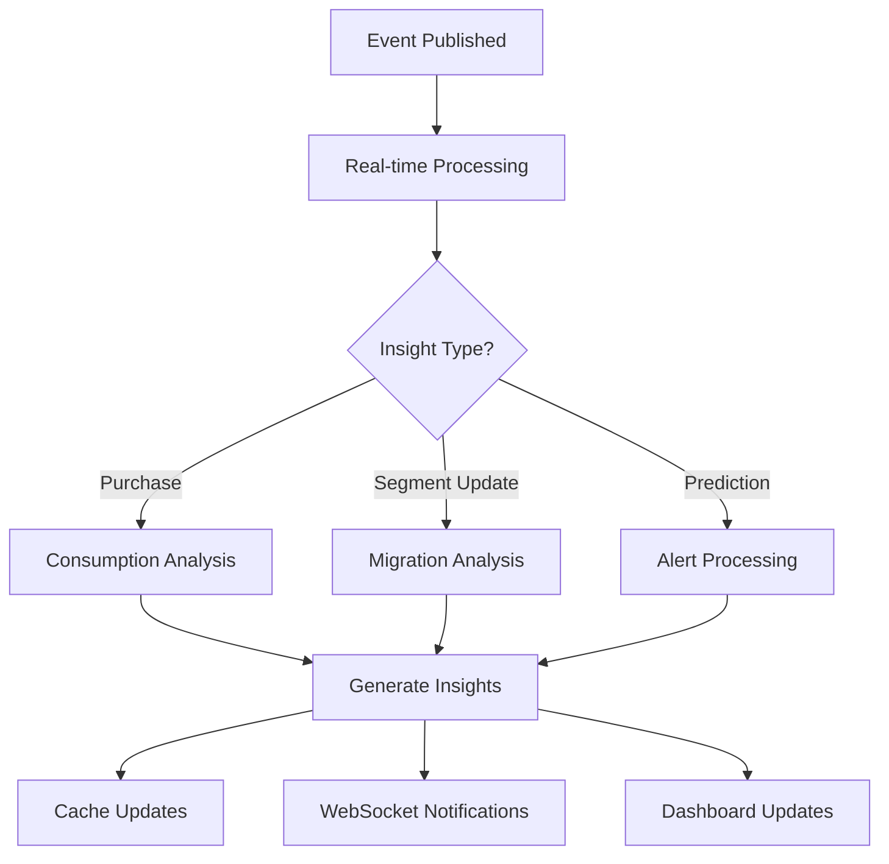

# OMNIX AI - Real-time Streaming Analytics Guide

## 🌊 Overview

The OMNIX AI real-time streaming analytics system provides instant insights and personalization using AWS Kinesis for event streaming and real-time processing. This system processes customer events in real-time to generate actionable insights, trigger segment updates, and enable immediate personalization responses.

## 🏗️ Architecture

### Core Components

1. **KinesisStreamingService** - Publishes events to Kinesis streams
2. **RealtimeAnalyticsService** - Processes events and generates insights
3. **StreamingAnalyticsController** - API endpoints for event publishing and monitoring
4. **Event Integration** - Automatic event publishing from Orders and Customer Segmentation services

### Event Types

#### 1. Purchase Events
```typescript
interface PurchaseEvent {
  customerId: string;
  productId: string;
  productCategory: string;
  productName: string;
  quantity: number;
  price: number;
  totalAmount: number;
  timestamp: string;
  location?: string;
  paymentMethod?: string;
  deviceType?: 'web' | 'mobile' | 'pos';
  metadata?: Record<string, any>;
}
```

#### 2. Customer Segment Update Events
```typescript
interface CustomerSegmentUpdateEvent {
  customerId: string;
  previousSegment: string | null;
  newSegment: string;
  segmentationScore: number;
  reasonCodes: string[];
  timestamp: string;
  confidence: number;
  modelVersion: string;
}
```

#### 3. Consumption Prediction Events
```typescript
interface ConsumptionPredictionEvent {
  customerId: string;
  productId: string;
  predictedConsumptionDate: string;
  confidence: number;
  predictionType: 'pattern-based' | 'ai-enhanced' | 'seasonal';
  factors: string[];
  timestamp: string;
  alertTriggered: boolean;
}
```

## 🚀 Getting Started

### 1. Setup AWS Kinesis Infrastructure

```bash
# Run the setup script
./setup-kinesis-streaming.sh
```

This script will:
- Create the Kinesis data stream
- Set up IAM roles and permissions
- Configure CloudWatch monitoring
- Create monitoring dashboards

### 2. Configure Environment Variables

Add these to your Lambda environment variables:

```bash
KINESIS_STREAM_NAME=omnix-ai-customer-events
AWS_REGION=eu-central-1
KINESIS_SHARD_COUNT=2
KINESIS_RETENTION_HOURS=24
KINESIS_ENABLE_COMPRESSION=true
KINESIS_BATCH_SIZE=100
KINESIS_MAX_LATENCY_MS=100
```

### 3. Deploy Updated Application

```bash
# Build and deploy
npm run build:lambda
./deploy-lambda.sh
```

## 📡 API Endpoints

### Event Publishing

#### Publish Purchase Event
```http
POST /v1/streaming/events/purchase
Authorization: Bearer <token>
Content-Type: application/json

{
  "customerId": "customer-123",
  "productId": "product-456",
  "productCategory": "beverages",
  "productName": "Premium Coffee Beans",
  "quantity": 2,
  "price": 24.99,
  "totalAmount": 49.98,
  "timestamp": "2025-01-19T10:30:00Z",
  "location": "Store A",
  "paymentMethod": "credit_card",
  "deviceType": "web"
}
```

#### Publish Segment Update Event
```http
POST /v1/streaming/events/segment-update
Authorization: Bearer <token>
Content-Type: application/json

{
  "customerId": "customer-123",
  "previousSegment": "New Customer",
  "newSegment": "Potential Loyalist",
  "segmentationScore": 0.85,
  "reasonCodes": ["high_value_customer", "frequent_purchaser"],
  "timestamp": "2025-01-19T10:30:00Z",
  "confidence": 0.85,
  "modelVersion": "v1.0"
}
```

#### Publish Batch Events
```http
POST /v1/streaming/events/batch
Authorization: Bearer <token>
Content-Type: application/json

[
  { /* purchase event 1 */ },
  { /* purchase event 2 */ },
  { /* segment update event */ }
]
```

### Monitoring & Management

#### Get Stream Status
```http
GET /v1/streaming/stream/status
Authorization: Bearer <token>
```

#### Get Stream Metrics
```http
GET /v1/streaming/stream/metrics
Authorization: Bearer <token>
```

#### List Streams
```http
GET /v1/streaming/streams
Authorization: Bearer <token>
```

#### Create Stream
```http
POST /v1/streaming/stream/create
Authorization: Bearer <token>
```

### Real-time Insights

#### Get Customer Insights
```http
GET /v1/streaming/insights/{customerId}?hours=24
Authorization: Bearer <token>
```

#### Get System Overview
```http
GET /v1/streaming/insights/system/overview
Authorization: Bearer <token>
```

## 🔄 Automatic Event Publishing

### From Orders Service

When an order status changes to `RECEIVED`, the system automatically:

1. **Extracts purchase data** from order items
2. **Creates PurchaseEvent** for each item
3. **Publishes to Kinesis** in batch
4. **Triggers real-time analysis**

### From Customer Segmentation Service

When a customer's segment changes, the system automatically:

1. **Detects segment migration**
2. **Creates CustomerSegmentUpdateEvent**
3. **Publishes to Kinesis**
4. **Updates cached recommendations**

## 🧠 Real-time Insights Generation

### Insight Types

1. **Segment Migration** - Customer moved between segments
2. **Consumption Prediction** - High-confidence purchase predictions
3. **Behavior Anomaly** - Unusual purchasing patterns detected
4. **Recommendation Update** - New personalization opportunities

### Processing Flow



### Insight Priority Levels

- **Critical** - Immediate action required (e.g., high-value customer at risk)
- **High** - Important insights requiring attention
- **Medium** - Standard insights for review
- **Low** - Informational insights

## 📊 Monitoring & Analytics

### CloudWatch Dashboards

The setup creates comprehensive monitoring dashboards:

1. **Kinesis Records** - Incoming/outgoing record counts
2. **Throttling Events** - Write/read provisioned throughput exceeded
3. **Iterator Age** - Processing lag measurement
4. **Data Throughput** - Bytes processed per second

### Key Metrics to Monitor

- **IncomingRecords** - Events being published
- **OutgoingRecords** - Events being consumed
- **IteratorAgeMilliseconds** - Processing delay
- **WriteProvisionedThroughputExceeded** - Need to scale up
- **ReadProvisionedThroughputExceeded** - Consumer scaling needed

### Alerts Setup

Monitor for:
- Iterator age > 60 seconds (processing lag)
- Throttling events > 5 per minute
- Error rate > 5%
- Zero incoming records for > 10 minutes

## 🔧 Configuration Options

### Stream Configuration

```typescript
interface StreamingAnalyticsConfig {
  kinesisStreamName: string;     // Stream name
  region: string;                // AWS region
  shardCount: number;            // Number of shards (2-4 recommended)
  retentionPeriodHours: number;  // Data retention (24-168 hours)
  enableCompression: boolean;    // Compress records
  batchSize: number;             // Batch publishing size
  maxLatency: number;            // Max latency in ms
}
```

### Real-time Processing Configuration

```typescript
// Buffer settings
bufferFlushInterval: 5000,     // Flush every 5 seconds
maxBufferSize: 50,             // Max events per customer buffer

// Insight thresholds
spendingDeviationThreshold: 0.5,    // 50% deviation triggers anomaly
highConfidenceThreshold: 0.7,       // Min confidence for insights
criticalConfidenceThreshold: 0.9    // Critical alert threshold
```

## 🧪 Testing

### Run Integration Tests

```bash
# Set environment variables
export API_BASE_URL="https://your-api-gateway-url"
export TEST_AUTH_TOKEN="your-test-jwt-token"

# Run tests
cd backend
npm test -- --grep "Streaming Analytics"
```

### Test Coverage

The test suite covers:
- Event publishing (individual and batch)
- Stream monitoring and metrics
- Real-time insights generation
- Error handling and validation
- Integration with existing services

## 🔒 Security Considerations

### Authentication & Authorization
- All endpoints require JWT authentication
- Role-based access for administrative operations
- Rate limiting on event publishing endpoints

### Data Protection
- Events are encrypted in transit and at rest
- PII data is handled according to GDPR requirements
- Customer data anonymization options available

### Network Security
- VPC endpoints for Kinesis access
- Security groups restrict access
- IAM roles follow least-privilege principle

## 📈 Performance Optimization

### Scaling Guidelines

#### Shard Count
- **1-2 shards**: Up to 1,000 events/second
- **3-4 shards**: Up to 4,000 events/second
- **5+ shards**: Scale based on throughput needs

#### Batch Processing
- Use batch publishing for high-volume scenarios
- Optimize batch size (50-500 records per batch)
- Implement exponential backoff for retries

#### Caching Strategy
- Cache frequently accessed insights
- Use TTL-based cache invalidation
- Implement cache warming for popular customers

## 🚨 Troubleshooting

### Common Issues

#### High Iterator Age
- **Cause**: Processing lag, consumer issues
- **Solution**: Scale consumers, optimize processing

#### Throttling Events
- **Cause**: Exceeded shard capacity
- **Solution**: Increase shard count or use exponential backoff

#### Failed Record Publishing
- **Cause**: Network issues, permissions, validation
- **Solution**: Check IAM roles, validate event format, retry logic

#### Missing Insights
- **Cause**: Processing errors, cache issues
- **Solution**: Check logs, verify event publishing, clear cache

### Debug Commands

```bash
# Check stream status
aws kinesis describe-stream --stream-name omnix-ai-customer-events

# View recent records
aws kinesis get-records --shard-iterator <iterator>

# Check CloudWatch metrics
aws cloudwatch get-metric-statistics --namespace AWS/Kinesis --metric-name IncomingRecords

# Test event publishing
curl -X POST https://api-url/v1/streaming/events/purchase \
  -H "Authorization: Bearer $TOKEN" \
  -d @test-event.json
```

## 📚 Additional Resources

- [AWS Kinesis Documentation](https://docs.aws.amazon.com/kinesis/)
- [Real-time Analytics Best Practices](https://aws.amazon.com/blogs/big-data/)
- [Customer Segmentation Guide](./CUSTOMER_SEGMENTATION_GUIDE.md)
- [A/B Testing Framework](./AB_TESTING_GUIDE.md)

## 🎯 Next Steps

With streaming analytics implemented, consider:

1. **Context-aware Personalization Engine**
   - Use real-time insights for dynamic personalization
   - Implement location-based and time-sensitive recommendations

2. **Business Intelligence Dashboards**
   - Create executive dashboards with streaming data
   - Implement real-time segment performance monitoring

3. **Multi-region Deployment**
   - Deploy streaming analytics across multiple regions
   - Implement cross-region data replication

4. **Advanced ML Features**
   - Real-time model training and updates
   - Anomaly detection with machine learning

---

**🎉 Congratulations!** You now have a fully functional real-time streaming analytics system that provides instant customer insights and enables dynamic personalization at scale.

For questions or support, please refer to the troubleshooting section or contact the development team.